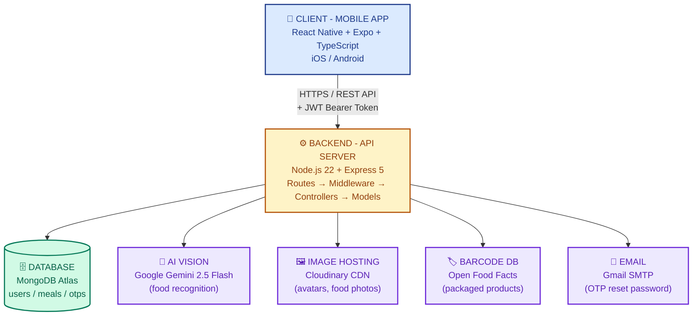
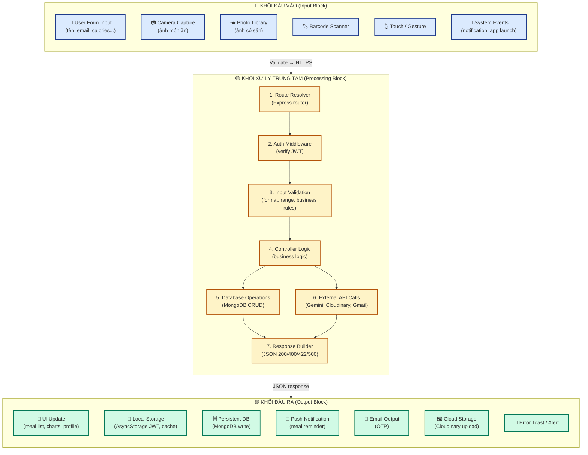
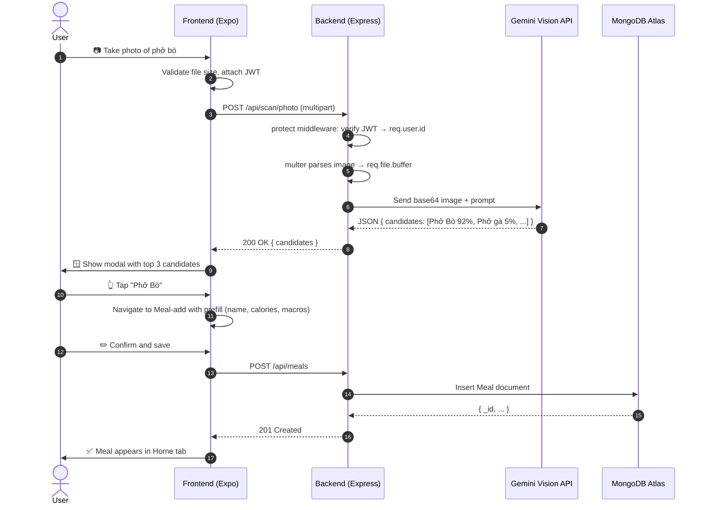

# HealthySnap - Architecture & Rules

## Tech Stack

| Layer | Technology |
|-------|-----------|
| Mobile App | React Native + Expo + TypeScript |
| Navigation | Expo Router |
| Backend | Node.js + Express |
| Database | MongoDB Atlas |
| Auth | JWT |
| AI Scan (photo) | Claude API (food recognition) + Nutritionix API (nutrition data) |
| Barcode Scan | Open Food Facts API (packaged food products) |

---

## Working Rules

### Before making any changes
- Discuss with team before modifying logic
- Do not change agreed rules without approval
- Follow this document as the single source of truth

### Testing
- Every feature must be tested immediately after implementation
- Do not move on to the next feature before testing the current one
- Backend: test with Postman
- Frontend: test with Expo Go

---

## Responsibility Split

### BACKEND responsibilities

**Auth**
- Validate all incoming data (name, email, password)
- Hash password with bcryptjs
- Generate JWT token
- Check duplicate email

**User & Profile**
- Store and update user profile
- Calculate BMI (from weight, height)
- Calculate TDEE (daily calorie need based on age, weight, height, activity level)
- Update calorie goal based on user's health goal

**Meal**
- Save meals to database
- Calculate total calories + macros (protein/carb/fat) per day
- Calculate % of daily calorie goal completed
- Return meal history by day/week/month

**AI Scan (photo)**
- Receive image from frontend
- Call Claude API to recognize food from photo
- Call Nutritionix API to get nutrition data
- Return results to frontend

**Barcode Scan**
- Receive barcode/QR code from frontend
- Call Open Food Facts API to get packaged food info
- Return product name + nutrition data to frontend

**AI Coach**
- Analyze eating habits over time
- Detect patterns (skipping meals, low protein, etc.)
- Generate personalized suggestions
- Warn about foods incompatible with user's health conditions

**Meal Plan**
- Save weekly meal plans
- Calculate total nutrition for entire plan

**Water & Exercise**
- Save water intake logs
- Save exercise activity logs
- Calculate daily totals

**Community**
- Save posts
- Handle follow/unfollow logic
- Return feed based on who user follows

**Statistics & Reports**
- Calculate nutrition trends by week/month
- Generate chart data

---

### FRONTEND responsibilities

**Auth**
- Display login/register forms
- UX validation (immediate feedback without API call)
- Store JWT token in AsyncStorage

**UI & Navigation**
- Render all screens
- Handle navigation between tabs/screens

**Meal**
- Manual meal entry form
- Display meal list
- Display total calories/macros returned from backend

**Scan screen**
- Quét QR/Barcode sản phẩm đóng gói → gửi mã lên backend → hiển thị kết quả
- Chụp ảnh món ăn → gửi ảnh lên backend → AI nhận diện → hiển thị kết quả
- Cả 2 đều dẫn tới form Add Meal để review trước khi save

**Add Meal**
- Nhập thông tin thủ công
- Có thể thêm ảnh từ thư viện (không bắt buộc)
- Có trường thời gian dùng bữa cụ thể (giờ:phút)

**AI Coach**
- Display suggestions and warnings returned from backend

**Meal Plan**
- Meal plan creation form
- Display weekly meal calendar

**Water & Exercise**
- Water and exercise input forms
- Display daily progress

**Community**
- Display feed
- Post creation form, follow button

**Statistics**
- Render charts from backend data
- No self-calculation

---

## Validation Rules

### Name
- Minimum 2 characters
- Letters and spaces only (no numbers or special characters)
- Vietnamese characters allowed

### Email
- Valid format: `example@domain.com`
- Case insensitive (stored as lowercase in DB)

### Password
- Minimum 6 characters
- At least 1 uppercase letter
- At least 1 number

---

## API Response Format

### Success
```json
{
  "data": {},
  "message": "Success"
}
```

### Error
```json
{
  "message": "Error description"
}
```

---

## Project Structure

```
HealthySnap/
  backend/
    src/
      config/       - Database connection
      controllers/  - Business logic & validation
      middleware/   - Auth middleware
      models/       - MongoDB schemas
      routes/       - API routes
    server.js
    .env
  frontend/
    app/
      auth/         - Login, Register screens
      context/      - AuthContext, MealsContext
      tabs/         - Main app screens
      ui/           - Reusable components
      utils/        - API helper
    app.json
```

---

## System Architecture Diagram

High-level overview of components and how they connect:



---

## Logic Flow Diagram (Input → Processing → Output)

Every user interaction follows the same 3-block pattern:



---

## Example: AI Photo Scan flow

Concrete walkthrough of the 3-block model when a user scans food:



---

## Data shape per use case

| Use Case | Input | Processing | Output |
|---|---|---|---|
| **Register** | name, email, password | Validate → bcrypt hash → check duplicate → save → sign JWT | JWT in AsyncStorage, user in DB |
| **Login** | email, password | Find user → bcrypt.compare → sign JWT 30 days | JWT token, user object |
| **Add meal** | name, calories, macros, date, mealType | Validate → save Meal → recompute daily totals | Meal in Home, total kcal updated |
| **AI Scan** | JPEG image (≤ 8MB) | Base64 encode → Gemini API → parse JSON → top 3 candidates | Modal with 3 cards, prefill Meal-add |
| **Update Profile** | weight, height, age, goal | Validate range → save → compute BMI + TDEE | Profile UI, stats refresh, AsyncStorage sync |

---

## Architecture principles

1. **Separation of Concerns** — Frontend = UI/UX, Backend = business logic + persistence.
2. **Single Responsibility** — Each controller handles one domain (auth/meal/profile/scan).
3. **Statelessness** — Backend does not store sessions; every request carries JWT.
4. **Fail Fast** — Validate at frontend (UX) AND backend (security).
5. **Loose Coupling** — Vision API, image host, DB are all swappable via config.
6. **Security First** — bcrypt hash, JWT verify, `.env` secrets, input sanitize.
