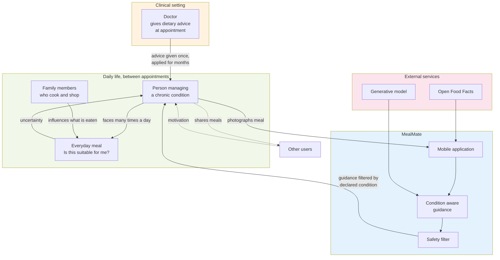
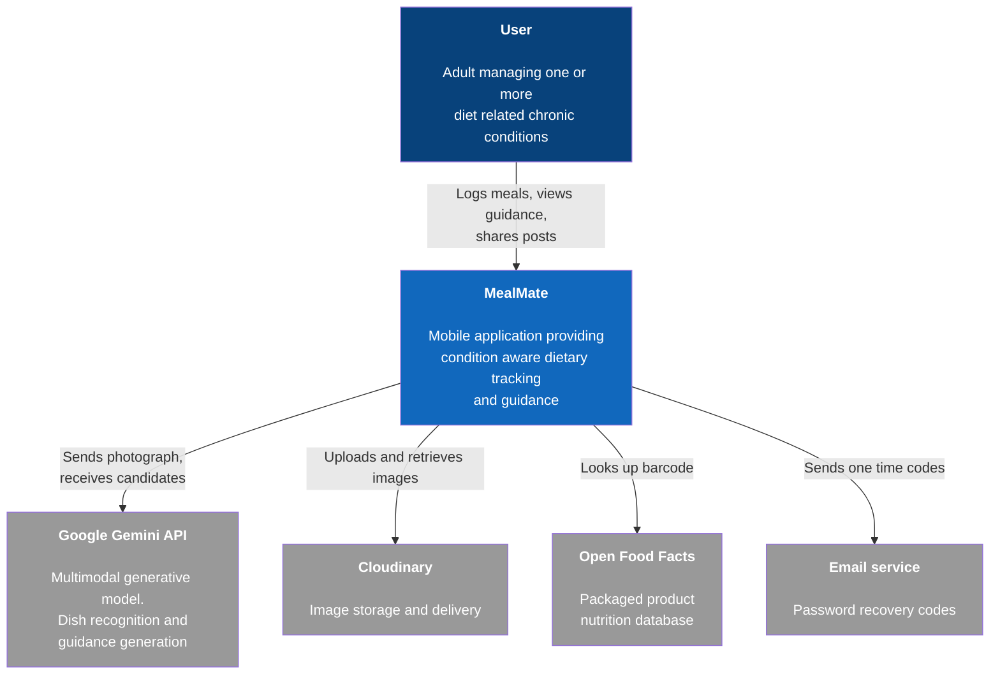
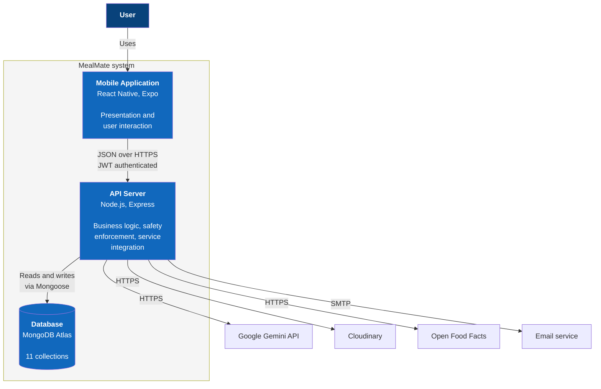
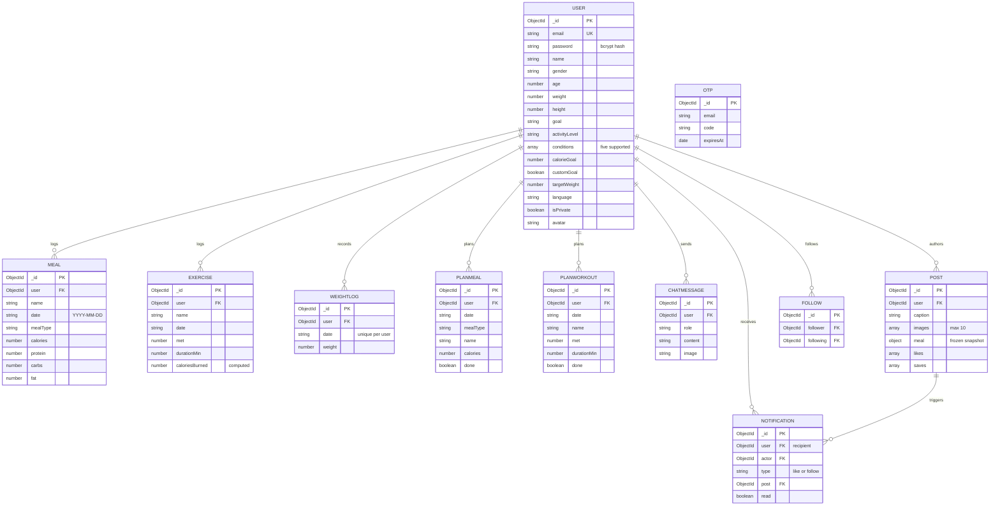
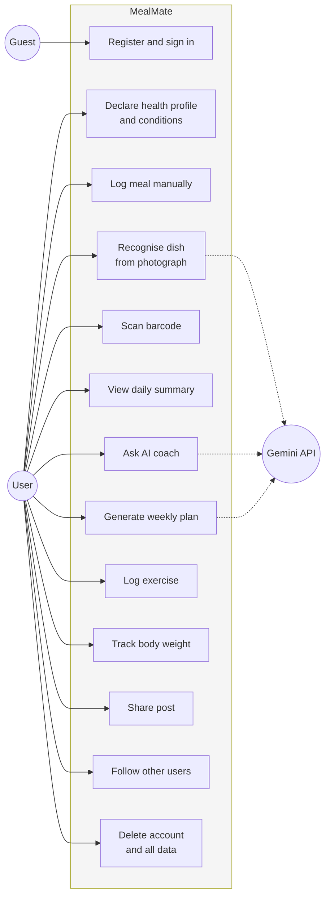
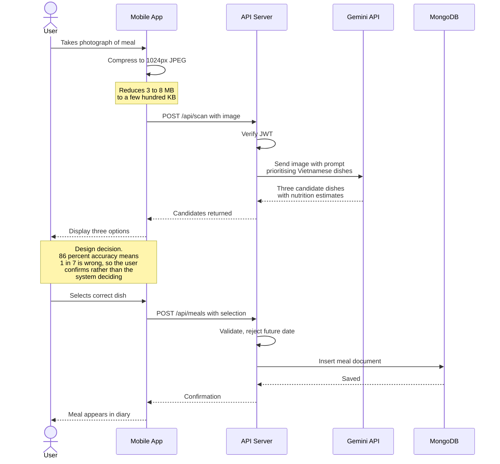
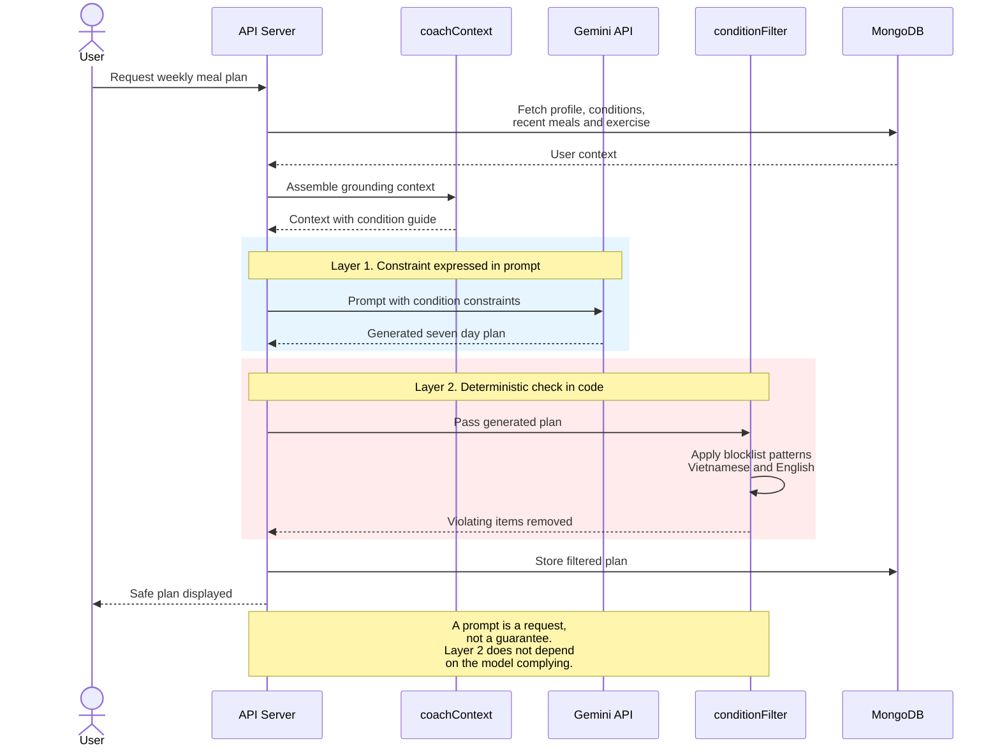
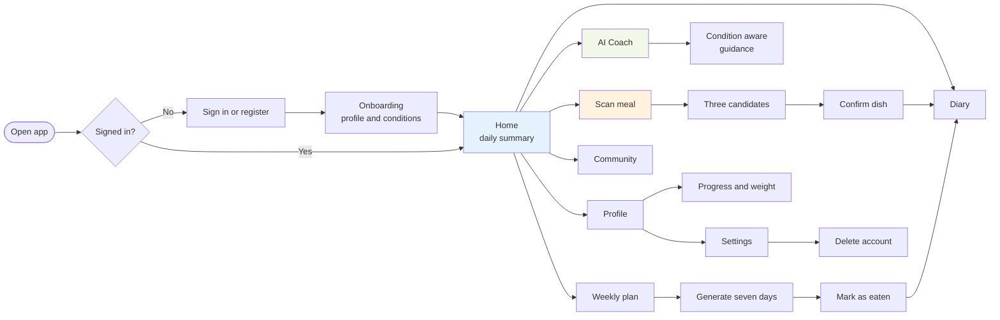

# Sơ đồ cho Chương 4.8 (mã Mermaid)

> **Cách dùng:**
> 1. Mở `https://mermaid.live`
> 2. Xoá hết nội dung mẫu bên trái, dán mã của một sơ đồ vào
> 3. Hình hiện bên phải, bấm **Actions > PNG** để tải ảnh
> 4. Chèn ảnh vào Word, đánh số hình và viết chú thích bên dưới
>
> **Lưu ý:** mọi tên và quan hệ trong sơ đồ đều lấy từ **code thật** của mày, không phải mô hình lý tưởng hoá.

---

## 4.8.2 Rich Picture

Bức tranh tổng thể về bối cảnh vấn đề, gồm cả yếu tố con người chứ không chỉ kỹ thuật.

> 💡 Rich Picture khác sơ đồ kỹ thuật ở chỗ nó **có con người và bối cảnh xã hội**. Chú ý mũi tên từ bác sĩ ghi "advice given once, applied for months", đó chính là vấn đề trung tâm của đồ án mày.

---

## 4.8.3 System Context Diagram (C4 Level 1)

Hệ thống nhìn từ ngoài vào, ai dùng và nối với dịch vụ nào.

---

## 4.8.4 Container Diagram (C4 Level 2)

Bên trong hệ thống có những khối chạy độc lập nào.

> 💡 Nhớ chỉ ra trong bài rằng **lớp lọc an toàn nằm ở API Server chứ không ở Mobile Application**. Đó là quyết định kiến trúc quan trọng nhất, đã lập luận ở mục 4.8.1 và 6.3.3.

---

## 4.8.5 Data Design

Sơ đồ quan hệ 11 collection, lấy đúng theo model thật trong `backend/src/models/`.

> 💡 **Ba điểm nên nêu trong bài khi mô tả sơ đồ này:**
> 1. `POST.meal` là **bản sao đông cứng** chứ không phải tham chiếu, nên sửa hay xoá món trong nhật ký không làm hỏng bài đã đăng
> 2. `WEIGHTLOG` có **chỉ mục duy nhất theo user và date**, chặn trùng ở tầng cơ sở dữ liệu chứ không phải ở mã ứng dụng
> 3. `OTP` liên kết bằng **email chứ không phải user id**, vì luồng quên mật khẩu diễn ra khi chưa đăng nhập

---

## 4.8.6 Use Case Diagram

---

## 4.8.7 Sequence Diagram: luồng quét ảnh nhận diện món

Chọn luồng này vì nó phức tạp nhất và thể hiện rõ **quyết định thiết kế bắt người dùng xác nhận**.

> 💡 Khối Note ở giữa là chỗ mày **gắn quyết định thiết kế vào bằng chứng học thuật** ngay trên sơ đồ. Người chấm nhìn hình là hiểu vì sao có bước xác nhận.

---

## 4.8.8 Sequence Diagram: lớp an toàn theo bệnh nền

Sơ đồ phụ, thể hiện kiến trúc 2 lớp, tức đóng góp học thuật của đồ án.

---

## 4.8.9 Wireframes

`[[🔴 TA KHÔNG DỰNG ĐƯỢC, CẦN MÀY]]`

> Wireframe là bản phác giao diện. Vì app mày **đã làm xong**, cách nhanh nhất là **chụp màn hình app thật trên iPhone** rồi trình bày như thiết kế giao diện, kèm một sơ đồ luồng người dùng.
>
> Cần chụp: Home, Scan, Diary, Coach, Plan, Community, Profile.
>
> Nếu thầy yêu cầu wireframe phác thảo trước khi code thì vẽ tay hoặc dùng Figma, nhưng ảnh chụp app thật thường được chấp nhận và còn thuyết phục hơn.

Luồng người dùng chính, dùng luôn được:

---

# HƯỚNG DẪN CHÈN VÀO BÁO CÁO

| Sơ đồ | Mục | Ghi chú khi viết |
|---|---|---|
| Rich Picture | 4.8.2 | Nhấn vào chuyện lời dặn của bác sĩ chỉ có một lần mà phải áp dụng hàng tháng |
| C4 Level 1 | 4.8.3 | Liệt kê 4 dịch vụ ngoài và hành vi khi chúng lỗi |
| C4 Level 2 | 4.8.4 | **Nhấn mạnh lớp lọc nằm ở server chứ không ở client** |
| Data Design | 4.8.5 | Nêu 3 điểm: snapshot, chỉ mục duy nhất, OTP theo email |
| Use Case | 4.8.6 | 13 use case, 3 cái phụ thuộc dịch vụ ngoài |
| Sequence quét ảnh | 4.8.7 | Gắn với con số 86 phần trăm của Mezgec |
| Sequence an toàn | 4.8.7 | Đây là đóng góp học thuật, nhắc lại ở Chương 8 |
| User flow | 4.8.9 | Kèm ảnh chụp màn hình thật |

**Đánh số hình theo chương**, ví dụ Figure 4.1, Figure 4.2, và mỗi hình phải có **câu chú thích bên dưới** cùng ít nhất một câu nhắc tới nó trong phần văn.
